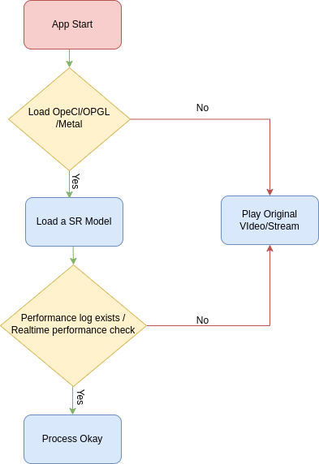

# GDF SR SDK

## Android Summary 

Android 기기를 위한 [GDFLab](https://gdflab.com)의 초해상도 기술 SDK.

[GDFPlay](https://gdfplay.io)는 애플리케이션, `GDFSR`이 실제 SDK 라이브러리 모듈이며, `gdfplayer`는 라이브러리 사용 예시 프로젝트 입니다.

GDFSRProcessor is wrapper of GDFSR library dedicated to Video Super Resolution.

This class can be applied to
* <a href="https://developer.android.com/guide/topics/media/mediaplayer">MediaPlayer</a> or
* <a href="https://exoplayer.dev">ExoPlayer</a>.


입력 영상의 해상도를 알게된 시점에 아래의 코드를 이용해 GDFSRProcessor 객체를 생성합니다.

영상의 모든 프레임에 대해 아래처럼 업스케일을 반복적으로 진행합니다.


## iOS Summary 

iOS 기기를 위한 [GDFLab](https://gdflab.com)의 초해상도 기술 SDK.

[GDFPlay](https://gdfplay.io)는 애플리케이션, `GDFSR`이 실제 SDK 라이브러리 모듈이며, `gdfplayer`는 라이브러리 사용 예시 프로젝트 입니다.

GDFSRProcessor is wrapper of GDFSR library dedicated to Video Super Resolution.

This class can be applied to
* [Storyboard](https://developer.apple.com/documentation/avfoundation/avplayer/) 


입력 영상의 해상도를 알게된 시점에 아래의 코드를 이용해 GDFSRProcessor 객체를 생성합니다.

영상의 모든 프레임에 대해 아래처럼 업스케일을 반복적으로 진행합니다.


---
## Flowchart

<p align="center">

</p>

---
## Android Usage
### Usage of this class with MediaPlayer:

```java
class VideoPlayActivity extends AppCompatActivity {
    // this ImageView must be placed in layout, where the video will be showed.
    private ImageView displayView;
    // play button should be placed in layout also.
    private Button btnPlay;

    MediaPlayer player = null;
    GDFSRProcessor videoSR = null;

    @Override
    protected void onCreate(Bundle savedInstanceState) {
        // media resolution should be one of:
        // 320x180, 426x240, 480x270, 640x360, 854x480
        String mediaPath = "https://test-videos.co.uk/vids/bigbuckbunny/mp4/h264/360/Big_Buck_Bunny_360_10s_10MB.mp4";
        player = new MediaPlayer()
        player.setDataSource(mediaPath);
        player.prepareAsync();
        player.setOnPreparedListener(mp -> {
            videoSR = new GDFSRProcessor(activity, player.getVideoWidth(), player.getVideoHeight());
            videoSR.setDisplayView(displayView);
            player.setSurface(videoSR.getPlayerSurface());
            player.setOnCompletionListener(p -> {
                videoSR.release();
                player.release();
                videoSR = null;
                player = null;
            });
            player.start();
        });
    }
  ...
}
```

### Usage of this class with ExoPlayer:
```java
class VideoPlayActivity extends AppCompatActivity {
    // this ImageView must be placed in layout, where the video will be showed.
    private ImageView displayView;
    // play button should be placed in layout also.
    private Button btnPlay;

    ExoPlayer player = null;
    GDFSRProcessor videoSR = null;

    @Override
    protected void onCreate(Bundle savedInstanceState) {
        // media resolution should be one of:
        // 320x180, 426x240, 480x270, 640x360, 854x480
        String mediaPath = "https://test-videos.co.uk/vids/bigbuckbunny/mp4/h264/360/Big_Buck_Bunny_360_10s_10MB.mp4";
        Uri uri = Uri.parse(mediaPath);
        DataSource.Factory dataSourceFactory = new DefaultDataSource.Factory(this);
        MediaSource mediaSource;
        @C.ContentType int type = Util.inferContentType(uri);
        if (type == C.CONTENT_TYPE_DASH) {
            mediaSource =
                new DashMediaSource.Factory(dataSourceFactory)
                    .createMediaSource(MediaItem.fromUri(uri));
        } else if (type == C.CONTENT_TYPE_OTHER) {
            mediaSource =
                new ProgressiveMediaSource.Factory(dataSourceFactory)
                    .createMediaSource(MediaItem..fromUri(uri));
        } else {
            throw new IllegalStateException();
        }

        int videoWidth, videoHeight, videoDuration;
        try (MediaMetadataRetriever retriever = new MediaMetadataRetriever()) {
            retriever.setDataSource(uri.toString(), new HashMap<>());
            String height = retriever.extractMetadata(MediaMetadataRetriever.METADATA_KEY_VIDEO_HEIGHT);
            String width = retriever.extractMetadata(MediaMetadataRetriever.METADATA_KEY_VIDEO_WIDTH);
            String duration = retriever.extractMetadata(MediaMetadataRetriever.METADATA_KEY_DURATION);
            videoWidth = Integer.parseInt(width);
            videoHeight = Integer.parseInt(height);
            videoDuration = Integer.parseInt(duration);
        } catch (IOException e) {
            throw new RuntimeException("cannot get video information: "+uri.toString(), e);
        }
        player = new ExoPlayer.Builder(this).build();
        player.setMediaSource(mediaSource);
        player.prepare();
        videoSR = new GDFSRProcessor(this, videoWidth, videoHeight);
        videoSR.setDisplayView(displayView);
        player.setVideoSurface(videoSR.getPlayerSurface());
        player.addListener(new Player.Listener() {
            @Override
            public void onPlaybackStateChanged(int playbackState) {
                Player.Listener.super.onPlaybackStateChanged(playbackState);
                if (playbackState == Player.STATE_ENDED) {
                    videoSR.release();
                    player.release();
                    videoSR = null;
                    player = null;
                }
            }
        });
        player.play();
    }
    ...
}


```
## iOS Usage
- Xcode Version 14.2
- iOS - Storyboard  14.0 이상 / SwiftUI 15.0 이상
- Cocoa pod install
- x86 기반 iphone simulator에서는 정상 동작하지 않습니다.
- 실제 device에서 테스트
### Storyboard - Usage of this class with AVPlayer:

```swift
import MetalKit
import AVKit
import VideoToolbox
import GDFSR

class VideoMetalView: MTKView {
    private var videoSR: GDFSRVideo?
    private var player: AVPlayer?
    deinit {
        stop()
    }
    func play(stream: URL) throws {
        device = device ?? MTLCreateSystemDefaultDevice()
        framebufferOnly = false
        layer.isOpaque = true
        let item = AVPlayerItem(url: stream)
        self.player = AVPlayer(playerItem: item)
        self.videoSR = GDFSRVideo(metalView: self, videoItem: item) {
            // now video can be played
            self.play()
        }
    }
    func play() { player?.play() }
    func pause() { player?.pause() }
    func stop() {
        player?.rate = 0
        videoSR?.release()
        videoSR = null
        player = null
    }
}
```

```swift
import Foundation
import UIKit
import OSLog
import GDFSR

class VideoViewController: UIViewController, VideoMetalViewDelegate {

    @IBOutlet weak var videoView: VideoMetalView!
    @IBOutlet weak var videoControls: UIStackView!
    @IBOutlet weak var sliProgress: UISlider!
    @IBOutlet weak var lblElapsed: UILabel!
    @IBOutlet weak var lblRemain: UILabel!
    @IBOutlet weak var closeControl: UIStackView!
    @IBOutlet weak var btnPlay: UIButton!
    @IBOutlet weak var txtFileName: UITextField!
    @IBOutlet weak var segBtns: UISegmentedControl!
    @IBOutlet weak var btnInfo: UIButton!
    @IBOutlet weak var btnRepeat: UIButton!
    @IBOutlet weak var noSDKText: UILabel!
    
    var fileItem: FileItem!

    private var showState = false
    private var isAuto = false
    private var isPlaying = true
    private let playImage = UIImage(systemName: "play.fill")
    private let pauseImage = UIImage(systemName: "pause.fill")
    private var showInfo = false
    private var repeatVideo = false
    private var prevPoint: CGPoint = .zero

    
    override func viewDidLoad() {
        super.viewDidLoad()

        videoView?.videoDelegate = self
    
        // set video file name
        txtFileName.text = fileItem.name
        showControls(true)
        
        // examplevideo
        String mediaPath = "https://test-videos.co.uk/vids/bigbuckbunny/mp4/h264/360/Big_Buck_Bunny_360_10s_10MB.mp4"
        
        // video play
        DispatchQueue.main.async {
            if let vv = self.videoView {
                do {
                    self.btnPlay?.setBackgroundImage(self.pauseImage, for: .normal)
                    try vv.play(stream: URL(string:String mediaPath)!)
                    print("[VideoViewControrller] play")
                } catch {
                    GDFLog.error("\(error)")
                    self.onClose(self)
                }
            } else {
                self.onClose(self)
            }
        }
    }
```


### More Information
For More information and API list guide Please visit 
<a href="https://gdfplay.io/developer/doc/sdk/get-started/quick-start#gdfsdk">GDFPlay.io</a>

